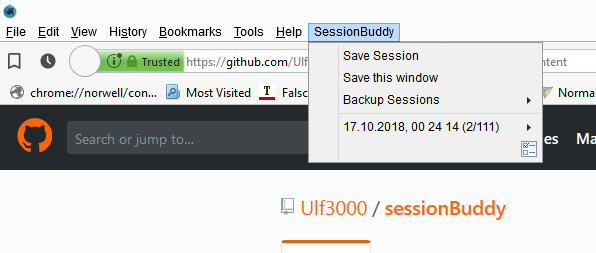

# sessionBuddy
simple session manager for waterfox and firefox quantum / xul /classic addon

you can store manually 
it also saves your crashes n backups 

small editing functions build in 

based on this userscript: 
https://github.com/Endor8/userChrome.js/blob/master/simplesessionmanager/SimpleSessionManager.uc.js
or
https://forum.mozilla-russia.org/viewtopic.php?id=57048
(i dont know the origin) 

but i replaced everything with up to date librarys n stuff and added some bells n whistles.. so its also compatible up to ff64 and works together with multiple windows ..

private windows are not saved ! 

it doesnt have any removal functions(cause im too lazy) so if you wanna deinstall it you have to either restart the browser or just wait till you restart anyways ...
